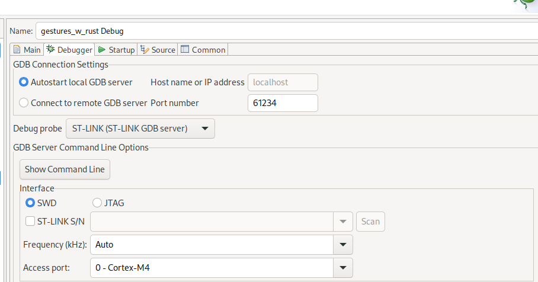

# gestures_w_rust

This project features a simple gesture recognition library that processes depth measurements coming from the low resolution TOF-Sensor "ST VL53L5CX".

It showcases integration of a Rust library into an Embedded-C STM32CubeIDE codebase.

The device is configured as HID device, and reports the recognized gestures to the USB host.

# Connection:

- AVdd must be connected to a 5V power rail
- IOVdd must be connected to a 3.3V power rail

Connect the other pins as documented in the CubeMX report.

# wave Rust crate

The library and bindings can be (re)built with `cargo build --release --target=thumbv7em-none-eabihf`.

Cbindgen is needed to (re)generate the header file. To install execute `cargo install --force cbindgen`.

The bindings are one header `wave.h` in the library root directory and the static lib `libwave.a` located in `target/release`

The library is rebuilt by the `prebuild_debug.sh` / `prebuild_release.sh` scripts, which are automatically executed as a pre-build step in the STM32CubeIDE project.

## Debugging

It is possible to debug the rust library with gdb. Simply compile with debugging symbols by setting `debug = true` in the cargo `[profile.dev]` profile and build it wihtout the `--release` flag. It might be necessary to optimize for binary size as well, depending on the memory constraints on the MCU: `opt-level = "s"`.

Then build the binary in STM32CubeIDE (also with the debug profile).

You can either launch the stlink gdb-server with STM32CubeIDE and attach to it from the terminal or VSCode, or launch a gdb-server yourself.

To enable debugging in vscode, the `Cortex-Debug` extension can be used.

To connect to the gdb-server launched with STM32CubeIDE, first take a look at the debug configuration, it should look like this:



Remember the port. Also only one debug session can be attached at a time, so it is necessary to detach the on in STM32CubeIDE first.

A configuration in VSCode could look like this:

```json
        {
            "name": "Attach to gdb-server and start debugging gesture_w_rust",
            "cwd": "${workspaceFolder}",
            "executable": "${workspaceFolder}/Debug/gestures_w_rust.elf",
            "gdbPath": "gdb",
            "request": "attach",
            "type": "cortex-debug",
            "servertype": "stlink",
            "gdbTarget": "localhost:61234"
        }
```

To start an own instance of a stlink gdb-server, write an entry that looks like this:

```json
        {
            "name": "Debug gesture_w_rust",
            "cwd": "${workspaceFolder}",
            "executable": "${workspaceFolder}/Debug/gestures_w_rust.elf",
            "gdbPath": "gdb",
            "request": "launch",
            "type": "cortex-debug",
            "servertype": "stlink",
        }
```


# HID device

The gestures are reported as HID keyboard keypresses:

- GestureSwipeRight: ArrowRight  
- GestureSwipeLeft: ArrowLeft
- GestureSwipeDown: ArrowDown
- GestureSwipeUp: ArrowUp
- GestureHold: Space

